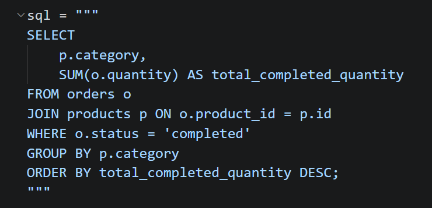
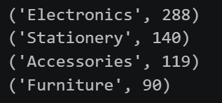
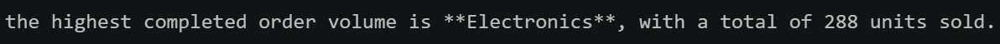

# 🛒 Store Analytics Agent

A local AI agent that answers natural-language questions about a SQLite store database — powered by **LlamaIndex**, **Ollama**, and a structured tool pipeline.

---

## 🧠 What It Does

You ask a plain-English question. The agent figures out what data it needs, writes a SQL query, runs it against a real SQLite database, and returns a clean business-language answer.

> **"Which product categories generate the highest completed order volume?"**

The agent answers: *"The highest completed order volume is **Electronics**, with a total of 288 units sold."*

---

## 🔧 How It Works — The Tool Pipeline

This project is built around **three specialized tools** that work together in a strict sequence. This design is intentional and critical.

```
User Question
     │
     ▼
┌──────────────┐
│  get_schema  │  ← Inspect the database structure (when needed)
└──────┬───────┘
       │
       ▼
┌──────────────────┐
│  ask_store_db    │  ← Generate SQL → Validate → Execute → Return rows
└──────┬───────────┘
       │
       ▼
┌──────────────────┐
│  summarize_rows  │  ← Turn raw rows into a human business answer
└──────────────────┘
```

### Why three tools? Why not just one?

This separation is **not** an over-engineering choice — it's what makes the agent reliable and safe.

---

### 🔍 Tool 1: `get_schema`

```python
def get_schema() -> str:
    """Useful for viewing the exact schema of the store database before writing or checking SQL."""
```

The LLM has no memory of the database between calls. Before writing any SQL, it may need to verify which tables exist, what columns are available, and how foreign keys relate. Without this tool, the model would either hallucinate column names or be forced to receive the full schema on every single call (wasteful). The agent calls this **only when needed**.

---

### 🗄️ Tool 2: `ask_store_db`

```python
def ask_store_db(question: Annotated[str, "A natural-language question about the store database"]) -> str:
    """Useful for answering questions about suppliers, products, customers, and orders."""
```

This is the core data-retrieval tool. It handles the full SQL lifecycle:

1. **Generation** — calls a local LLM (`gemma4:e2b` via Ollama) with a strict prompt to produce a raw SQL SELECT query
2. **Validation** — strips any markdown fences, checks for forbidden keywords (`INSERT`, `DROP`, `DELETE`, etc.), and ensures only `SELECT` queries reach the database
3. **Execution** — runs the validated SQL against the live SQLite file and returns structured rows

**The SQL generated by the LLM:**



**The raw rows returned:**



The tool returns a JSON object with the query, row count, and the first 10 rows — deliberately raw and unformatted. It is **not** the job of this tool to interpret the data. That's the next tool's responsibility.

---

### 💬 Tool 3: `summarize_rows`

```python
def summarize_rows(
    question: Annotated[str, "The original business question the rows are answering"],
    rows_json: Annotated[str, "A JSON string containing SQL result rows"],
) -> str:
    """Useful for turning raw SQL result rows into a short business-language explanation."""
```

This tool takes the raw JSON rows and the original question, then calls the LLM a second time — but this time purely for language generation, not SQL. It produces the final answer the user actually sees.

**Why separate this from `ask_store_db`?**

Because SQL execution and language summarization are fundamentally different tasks. Mixing them into one tool forces the model to do two things at once, which degrades reliability. Keeping them separate means:

- The SQL tool stays deterministic and auditable
- The summary tool gets focused context (just the rows + the question)
- You can debug each step independently

**The final agent response:**



---

## 📐 Database Schema

```
suppliers(id, name, country, lead_time_days)
products(id, name, category, price, stock, supplier_id)
customers(id, name, city, joined_date)
orders(id, product_id, customer_id, quantity, order_date, status)
  └─ status: 'completed' | 'pending' | 'cancelled'
```

Foreign keys:
- `products.supplier_id` → `suppliers.id`
- `orders.product_id` → `products.id`
- `orders.customer_id` → `customers.id`

---

## 🚀 Getting Started

### Prerequisites

- Python 3.10+
- [Ollama](https://ollama.com/) running locally with `gemma4:e2b` pulled
- A `store.db` SQLite file matching the schema above

### Install dependencies

```bash
pip install llama-index llama-index-llms-ollama
```

### Run

```bash
python agent.py
```

### Example query

Change the question inside `main()`:

```python
response = await agent.run(
    "Which product categories generate the highest completed order volume?"
)
```

---

## 🔒 SQL Safety

All SQL generated by the LLM is passed through a validation layer before execution:

- Only `SELECT` queries are allowed
- Forbidden keywords (`INSERT`, `UPDATE`, `DELETE`, `DROP`, `ALTER`, `PRAGMA`, `CREATE`, `ATTACH`) are blocked with regex word-boundary matching
- Markdown code fences are automatically stripped from LLM output

This means even if the LLM is prompted or tricked into generating a destructive query, it will never reach the database.

---

## 🏗️ Architecture Notes

| Component | Role |
|---|---|
| `FunctionAgent` (LlamaIndex) | Orchestrates tool calls and conversation |
| `Ollama` + `gemma4:e2b` | Local LLM for both SQL generation and summarization |
| `get_schema` | Schema introspection on demand |
| `ask_store_db` | SQL generation, validation, and execution |
| `summarize_rows` | Business-language answer generation |
| `store.db` | SQLite database with store data |
